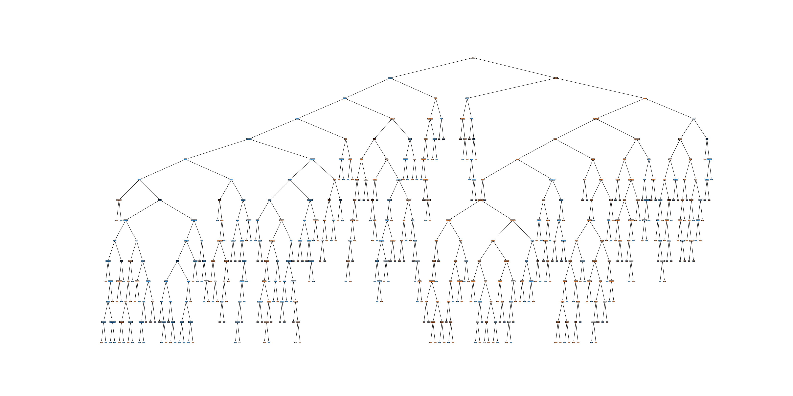
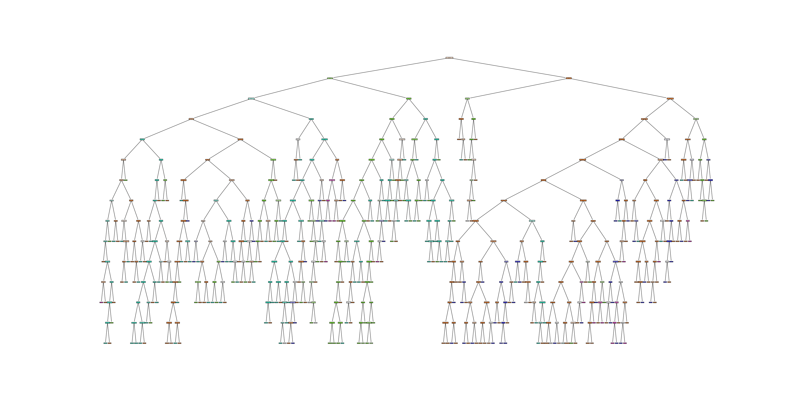
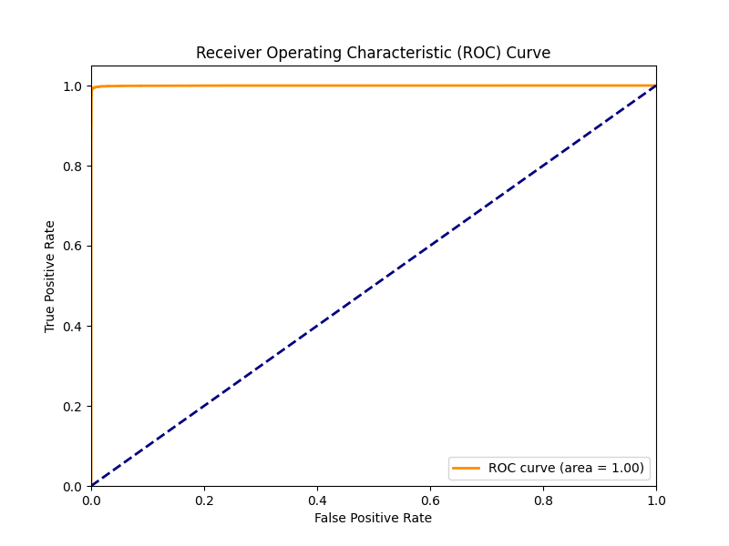

# Experiment 1 - Decision Tree on Binary Classification

Complete with command to run on test set: `./642test-$(uname -p) <MODEL_FILE_NAME> <THRESHOLD>`

### Q1: What hyperparameters did you vary, and what values did you try? What were some trends you observed?

Within the first experiment concerning the binary classification performed by a decision tree, I opted to set the random_state to 42 for the sake of consistency across multiple runs, then performed cross validation testing while varying the max_depth hyperparameter. In order to ascertain a better unerstanding of how the depth affected the model, I plotted cross-validation accuracy vs. the varying values of maximum tree depth and observed the relationship. In addition, I opted to map the relationship between validation and testing accuracy as depth increased. Ultimately, after noticing a steep increase in accuracy around depths 5-7 and a plateau of accuracy around depths 13-14, I opted to test a range of depths from 5-15. Though accuracy marginally increased in the range 20-30 (often peaking around 24-26), I felt that limiting the depth to this shorter range would better avoid overfitting and lead to a more accurate model when testing on unseen data. Finally, despite achieving the highest cross-validation accuracy around depth 14, the training accuracy began to worsen around depth 8 as validation accuracy improved (see figure training_vs_validation_error.png). Despite manually selecting depths of 7-8 for the final model, however, test accuracy maintained optimized around depth 14—causing me to implement this value for my final model.

### Q2: Provide an image of the trained decision tree. Discuss what you observe.

Since cross validation testing on the range 5-15 resulted in a selected maximum depth of 14, the trained decision tree appears complex with numerous nodes. Again, I would like to reiterate my concerns that the large depth of the tree could possibly lead to overfitting and the capturing of intricate patterns in the data that hold little implication across the data set as a whole. Nevertheless, I can not deny that a depth of 14 consistently provided the highest test accuracy of ~96% and above. Thus, the depth was maintained for the final model.

### Q3: Provide a plot of the feature importance. What were some of the most important features? Why do you think these features were important?

According to the above plot, the most important features appear to be: src_bytes (by a wide margin), protocol type, and dst_host_srv_count.
- Src_bytes: This feature likely represents the number of bytes sent from the source to the destination server in a network communication. High values of src_bytes may indicate unusually large data transfers which could be suggestive of certain types of attacks—in particular, Denial of Service (DoS) attacks. Consequently, the classifier assigns this feature high importance for distinguishing between normal and malicious network traffic.
- Protocol Type: This feature indicates the communication protocol employed in the network communication. One possible explanation for the importance of this feature may be the association of different attacks with different network protocols. For example, in class we learned that a TCP protocol proves closely associated with SYN flooding attacks. Thus, the classifier may find that distinguishing normal and malicious activity relies heavily on the type of protocol employed—as some may be more susceptible to attack than others.
- Dst_host_srv_count: This feature represents the number of services being run on the destination host. One possible explanation for the importance of this feature may be that an increase in the number of applications being served results in an increase in the likelihood of serving a malicious application. Further, returning to the example of SYN flooding attacks, serving a high number of users may also represent a DoS attack, thereby leading to the benefit of using dst_host_srv_count for classification.
### Q4: Plot a confusion matrix on the validation data. Discuss what you observe.

According to the above confusion matrix, we find the model proves extremely accurate on the test data as the false positive and false negative counts appear extremely low in comparison to the true positive and true negative counts. In fact, the matrix suggests the model demonstrates an accuracy of: 99.74%.

### Q5: Plot a ROC curve on the validation data. What do you find to be the optimal threshold for predicting something as positive?

According to the provided ROC curve, the apparent optimal threshold for predicting something as positive is ~1.0, implying a near perfect classifier.
---
---

# Experiment 2 - Decision Tree on Multiclass Classification

Complete with command to run on test set: `./642test-$(uname -p) <MODEL_FILE_NAME> <THRESHOLD>`

### Q1: What hyperparameters did you vary, and what values did you try? What were some trends you observed?

Building on experiment 1, when performing multiclass classification with the decision tree, I decided to again perform cross-validation testing on a variety of models with depths in the range 5-15 (again setting the random_state to 42 for each model). When plotting cross validation accuracy against tree depth, I again observed a similar trend of rising accuracy from depths 5-7 with a plateau beginning around 13-14. Allowing the final model to take on the optimal depth found during CV testing (a maximum depth of 14, same as experiment 1), my model achieved a test set accuracy of 99.72% on the data I reserved for final testing and an accuracy of 95.56% on the data reserved for experiment testing via `./642test-$(uname -p) exp2_model.pkl`.

### Q2: Provide an image of the trained decision tree. Discuss what you observe.

Since cross validation testing on the range 5-15 resulted in a selected maximum depth of 14, the trained decision tree appears complex with numerous nodes. Again, I would like to reiterate my concerns that the large depth of the tree could possibly lead to overfitting and the capturing of intricate patterns in the data that hold little implication across the data set as a whole. Nevertheless, I can not deny that a depth of 14 consistently provided the highest test accuracy of ~95% and above. Thus, the depth was maintained for the final model.

### Q3: Provide a plot of the feature importance. What were some of the most important features? Why do you think these features were important?

According to the above plot, the most important features appear to be: src_bytes (by a wide margin), count, and dst_host_srv_count.
- Src_bytes: This feature likely represents the number of bytes sent from the source to the destination server in a network communication. High values of src_bytes may indicate unusually large data transfers which could be suggestive of certain types of attacks—in particular, Denial of Service (DoS) attacks. Consequently, the classifier assigns this feature high importance for distinguishing between normal and malicious network traffic.

- Count: Likely functioning as the count of the number of connections to the same destination host, a high count may prove indicative of suspicious behavior. In particular, for certain attacks, such as a port scanning attack, a malicious user may engage in numerous connections with the server in an attempt to expose vulnerabilities in the system. Consequently, "count" must prove useful in separating benign and malicious traffic.

- DSt_host_srv_count: This feature represents the number of services being run on the destination host. One possible explanation for the importance of this feature may be that an increase in the number of applications being served results in an increase in the likelihood of serving a malicious application. Further, returning to the example of SYN flooding attacks, serving a high number of users may also represent a DoS attack, thereby leading to the benefit of using dst_host_srv_count for classification.

### Q4: Plot a confusion matrix on the validation data. Discuss what you observe.

According to the confusion matrix, the model proves extremely accurate as false identifications occurs relatively infrequently in comparison to correct categorization. Further, due to the labeling of each cell, one may conclude that the ordering of most to least frequently occurring categories of data are: benign samples, DoS traffic, Probe traffic, R2L traffic, and, finally, U2R traffic. Finally, one may note that the model struggles most in identifyinf class 3 samples, incorrectly marking 20 of the 251 as benign (0).

---
---

# Experiment 3 - Neural Network on Binary Classification

Complete with command to run on test set: `./642test-$(uname -p) <MODEL_FILE_NAME> <THRESHOLD>` 

### Q1: What hyperparameters did you vary, and what values did you try? What were some trends you observed?

In order to identify the optimal hyperparameters for the binary classification neural network, I opted to vary the number of hidden layers and the activation function employed. Initially, I sought to utilize GridSearchCV to analyze and compare the performance of different models, but I found my computer hindered by the run time. Consequently, I instead decided to perform several runs of the experiment, first varying the activation function among relu, tanh, logistic, and identity (the only available to MLPClassifier), then varying the number of hidden layers. Although logistic provided the highest validation accuracy of 94%, I found its test accuract low (78%) and decided relu would prove the best overall option. Then, beginning with a sized (20,) hidden layer, I progressed to test (30,), (40,), (50,), (100,), and (100,50) sized layers. Ultimately, after running the test code on the model with hidden layer sized (100,50) and a relu acitivation function, I achieved a test accuracy of 96.00%, leading me to conclude my exploration. Noticably, sizes as low as (20,) achieved ~92.55% accuracy on the test set.

As before with the decision tree classifier, I worried the model may experience overfitting with the large neuron size. Nevertheless, the testing accuracy proved sufficiently high, so I was led to conclude that the model operated well.

### Q2: Provide a plot of the loss curve over the epochs trained. What do you observe as the number of epochs increases?

According to the figure above, as the number of epochs increases, loss decreases, indicating the model improves over time.

### Q3: Plot a confusion matrix on the validation data. Discuss what you observe.

According to the above confusion matrix, we find the model proves extremely accurate on the validation data as the false positive and false negative counts appear extremely low in comparison to the true positive and true negative counts. In fact, the matrix suggests the model demonstrates an accuracy of: 99.55%.

### Q4: Plot a ROC curve on the validation data. What do you find to be the optimal threshold for predicting something as positive?

According to the provided ROC curve, the apparent optimal threshold for predicting something as positive is ~1.0, implying a near perfect classifier.

---
---

# Experiment 4 - Neural Network on Multiclass Classification

Complete with command to run on test set: `./642test-$(uname -p) <MODEL_FILE_NAME> <THRESHOLD>` 

### Q1: What hyperparameters did you vary, and what values did you try? What were some trends you observed?
Building on experiment 3, I again sought to vary the hyperparameters of hidden layer size and activation function. Utilizing my experimentation from the previous function, I decided to test a size of (100,50) with a relu activation function and immediately attained a 99.50% validation set accuracy and 94.54% test accuracy. Having already reached the required threshold of 88%, I condidered stopping my exploration, but decided to test even larger layers (given the greater number of classifications) to observe how it would affect performance. So, testing next a hidden layer size of (150,100), I found that performance on the validation and test sets both increased—to 99.58% and 95.08%, respectively. Similar to the decision tree classifier with multiclass classification, however, the model performed poorly at classifying the 4th class.

### Q2: Provide a plot of the loss curve over the epochs trained. What do you observe as the number of epochs increases?

As before with the binary classifier, the loss curve above indicates that, as the number of epochs increases, loss decreases—suggesting the model improves over time.

### Q3: Plot a confusion matrix on the validation data. Discuss what you observe.

According to the above confusion matrix, one finds that, for the vast majority of samples, the classifier performs an accurate identification. Nevertheless, the 39 class 3 samples predicted as benign (0) suggests significant room for improvement.